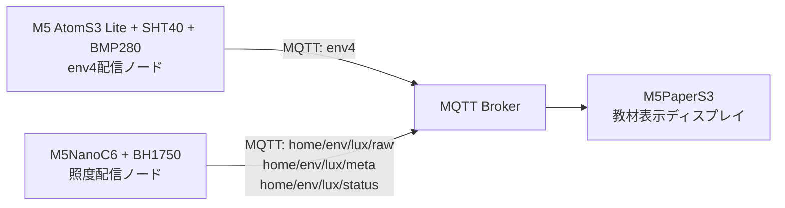

# M5PaperS3 Weather Learning System

[English README](./README.md)

このリポジトリは、3つのデバイス用リポジトリを束ねる統合ハブです。

- `atomS3Lite_w_env4`
- `M5NanoC6-BH1750-MQTT`
- `M5PaperS3-LuxEnv-Slides`

目的は、天気を自動で断定することではありません。  
気圧・湿度・明るさの変化を見ながら、学習者が「雨が近いかもしれない」と考えられる教材システムをまとめることです。

## システム全体像

## リポジトリ一覧

| 役割 | リポジトリ | 現在のローカルパス |
|---|---|---|
| 屋外環境センサ配信 | `atomS3Lite_w_env4` | `/Users/tomato/Documents/Arduino/atomS3Lite_w_env4` |
| 窓際照度センサ配信 | `M5NanoC6-BH1750-MQTT` | `/Users/tomato/Documents/Arduino/M5NanoC6-BH1750-MQTT` |
| 教材表示ディスプレイ | `M5PaperS3-LuxEnv-Slides` | `/Users/tomato/Documents/Arduino/M5PaperS3-LuxEnv-Slides` |

GitHub リポジトリ:

- [omiya-bonsai/atomS3Lite_w_env4](https://github.com/omiya-bonsai/atomS3Lite_w_env4)
- [omiya-bonsai/M5NanoC6-BH1750-MQTT](https://github.com/omiya-bonsai/M5NanoC6-BH1750-MQTT)
- [omiya-bonsai/M5PaperS3-LuxEnv-Slides](https://github.com/omiya-bonsai/M5PaperS3-LuxEnv-Slides)

## MQTT トピック対応

現在の統合トピックは次のとおりです。

- `env4`
- `home/env/lux/raw`
- `home/env/lux/meta`
- `home/env/lux/status`

補足:

- `env4` は気温・湿度・気圧・時刻メタデータを持ちます。
- `home/env/lux/raw` は最新照度を持ちます。
- `home/env/lux/meta` は照度の傾向判定向けメタ情報を持ちます。
- `home/env/lux/status` は照度ノードの状態・ネットワーク・時刻情報を持ちます。

## 各デバイスの責務

### 1. `atomS3Lite_w_env4`

配信内容:

- 気温
- 湿度
- 気圧
- Unix timestamp
- uptime / seq などの補助メタデータ

主トピック:

- `env4`

### 2. `M5NanoC6-BH1750-MQTT`

配信内容:

- 最新 lux
- lux の傾向メタ情報
- デバイス状態

主トピック:

- `home/env/lux/raw`
- `home/env/lux/meta`
- `home/env/lux/status`

### 3. `M5PaperS3-LuxEnv-Slides`

上記すべてのトピックを購読し、4枚の教材スライドとして表示します。

- Slide 1: 現在値
- Slide 2: 変化のサイン
- Slide 3: 短期傾向
- Slide 4: 長期傾向

## セットアップ順

1. 3台から到達できる MQTT ブローカーを用意する
2. `atomS3Lite_w_env4` を先にセットアップする
3. `M5NanoC6-BH1750-MQTT` をセットアップする
4. 2つの配信ノードが想定トピックを送っていることを確認する
5. `M5PaperS3-LuxEnv-Slides` をセットアップする
6. ディスプレイが4枚のスライドを live data で巡回表示することを確認する

## 推奨確認フロー

1. まず `env4` の payload を確認する
2. 次に `home/env/lux/raw` / `meta` / `status` を確認する
3. 両配信ノードで時刻が有効になっていることを確認する
4. 最後に PaperS3 を起動し、グラフと要約表示が埋まることを確認する

## 現在の統合状態

- 3つのデバイス用リポジトリは現在すべて `main`
- PaperS3 側は `home/env/lux/*` 名前空間を前提にしている
- 照度センサ側のコードもすでに `home/env/lux/*` を使っている
- もしサブリポの README に古い `home/lux*` 表記が残っていても、コード側を正として後で文書を揃える

## 今後ハブでやるとよいこと

- 各サブリポを GitHub 公開したらリンクを追加する
- ハードウェア全体図を1枚追加する
- スクリーンショット付きの通しセットアップ手順を作る
- `表示にデータが出ない`、`MQTT はつながるがグラフが出ない`、`time_valid が false` などのトラブルシュートを追加する
