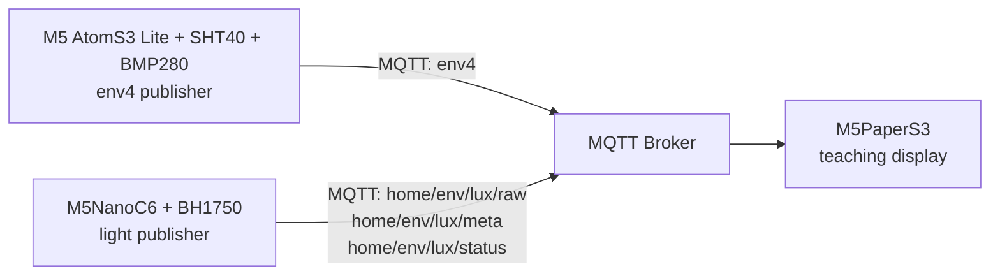

# M5PaperS3 Weather Learning System

[日本語版 README](./README.ja.md)

This repository is the integration hub for a small weather-learning system built from three device repositories:

- `atomS3Lite_w_env4`
- `M5NanoC6-BH1750-MQTT`
- `M5PaperS3-LuxEnv-Slides`

The goal is not fully automatic weather prediction.  
The goal is to help a learner observe pressure, humidity, and light changes, then think: "Is rain getting closer?"

Demo video:

- [YouTube: System demo](https://youtu.be/j70QptzSllY)

## System Overview

## Repositories

| Role | Repository | Current local path |
|---|---|---|
| Outdoor environment publisher | `atomS3Lite_w_env4` | `/Users/tomato/Documents/Arduino/atomS3Lite_w_env4` |
| Window-side light publisher | `M5NanoC6-BH1750-MQTT` | `/Users/tomato/Documents/Arduino/M5NanoC6-BH1750-MQTT` |
| Teaching display | `M5PaperS3-LuxEnv-Slides` | `/Users/tomato/Documents/Arduino/M5PaperS3-LuxEnv-Slides` |

GitHub repositories:

- [omiya-bonsai/atomS3Lite_w_env4](https://github.com/omiya-bonsai/atomS3Lite_w_env4)
- [omiya-bonsai/M5NanoC6-BH1750-MQTT](https://github.com/omiya-bonsai/M5NanoC6-BH1750-MQTT)
- [omiya-bonsai/M5PaperS3-LuxEnv-Slides](https://github.com/omiya-bonsai/M5PaperS3-LuxEnv-Slides)

## Topic Map

The current integrated topic set is:

- `env4`
- `home/env/lux/raw`
- `home/env/lux/meta`
- `home/env/lux/status`

Notes:

- `env4` carries temperature, humidity, pressure, and time metadata.
- `home/env/lux/raw` carries the latest light value.
- `home/env/lux/meta` carries trend-oriented light metadata.
- `home/env/lux/status` carries health / network / timing information for the light sensor node.

## Device Responsibilities

### 1. `atomS3Lite_w_env4`

Publishes:

- temperature
- humidity
- pressure
- Unix timestamp
- uptime and sequence metadata

Primary topic:

- `env4`

### 2. `M5NanoC6-BH1750-MQTT`

Publishes:

- latest lux
- lux trend metadata
- device status

Primary topics:

- `home/env/lux/raw`
- `home/env/lux/meta`
- `home/env/lux/status`

### 3. `M5PaperS3-LuxEnv-Slides`

Subscribes to all topics above and turns them into a four-slide teaching display:

- Slide 1: current values
- Slide 2: change signs
- Slide 3: short-term trend
- Slide 4: long-term trend

## Setup Order

1. Prepare an MQTT broker reachable by all three devices.
2. Set up and verify `atomS3Lite_w_env4`.
3. Set up and verify `M5NanoC6-BH1750-MQTT`.
4. Confirm that both publishers are sending the expected topics.
5. Set up `M5PaperS3-LuxEnv-Slides`.
6. Verify that the display rotates through all four slides with live data.

## Suggested Verification Flow

1. Check `env4` payloads first.
2. Check `home/env/lux/raw`, `meta`, and `status`.
3. Confirm that timestamps are valid on both publishers.
4. Power on the PaperS3 display last and verify that graphs and summaries fill in.

## Current Integration Status

- All three device repositories are currently on `main`.
- The PaperS3 display expects the `home/env/lux/*` topic namespace.
- The light-sensor repository code already uses `home/env/lux/*`.
- If a sub-repository README still shows `home/lux*`, treat the code as canonical and update the docs there later.

## Next Hub Improvements

- Add GitHub links after each sub-repository is published.
- Add a single hardware overview diagram.
- Add one end-to-end setup guide with screenshots.
- Add troubleshooting for "no data on display", "MQTT connected but no graph", and "time_valid is false".

## License

- Project license: [MIT](./LICENSE)
